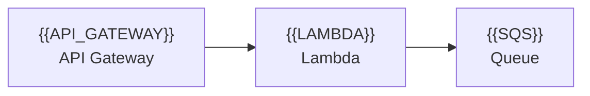
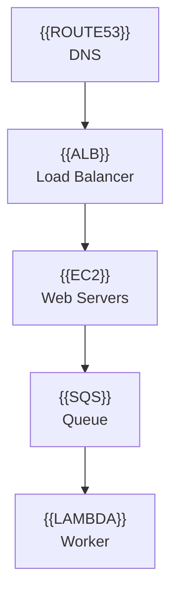

# Icon Reference Guide

## 🎨 Currently Configured Icons

These icons are ready to use in your `.mmd` files:

| Icon ID | Service | Category |
|---------|---------|----------|
| `{{EC2}}` | Amazon EC2 | Compute |
| `{{LAMBDA}}` | AWS Lambda | Compute |
| `{{AURORA}}` | Amazon Aurora | Database |
| `{{DYNAMODB}}` | Amazon DynamoDB | Database |
| `{{RDS}}` | Amazon RDS | Database |
| `{{S3}}` | Amazon S3 | Storage |
| `{{FOUNDRY}}` | Placeholder (Aurora) | Database |

## 📚 How to Find Available Icons

All your AWS icons are located in:
```
icons/AWS_Icons/Architecture-Service-Icons_07312025/
```

### Directory Structure by Category:

- **Arch_Compute/** - EC2, Lambda, ECS, EKS, etc.
- **Arch_Database/** - RDS, DynamoDB, Aurora, etc.
- **Arch_Storage/** - S3, EBS, EFS, Glacier, etc.
- **Arch_Networking-Content-Delivery/** - VPC, CloudFront, Route53, etc.
- **Arch_Analytics/** - Athena, EMR, Kinesis, etc.
- **Arch_App-Integration/** - SQS, SNS, EventBridge, etc.
- **Arch_Security-Identity-Compliance/** - IAM, Cognito, etc.
- **Arch_Management-Governance/** - CloudWatch, CloudFormation, etc.
- **Arch_Artificial-Intelligence/** - SageMaker, Bedrock, etc.
- **Arch_Developer-Tools/** - CodeCommit, CodeBuild, CodePipeline, etc.

## 🔍 Common Services Available

### Compute
- Amazon-EC2
- AWS-Lambda
- Amazon-ECS (Elastic Container Service)
- Amazon-EKS (Elastic Kubernetes Service)
- AWS-Batch
- AWS-Elastic-Beanstalk

### Database
- Amazon-Aurora
- Amazon-DynamoDB
- Amazon-RDS
- Amazon-ElastiCache
- Amazon-DocumentDB
- Amazon-Neptune
- Amazon-Timestream

### Storage
- Amazon-Simple-Storage-Service (S3)
- Amazon-Elastic-Block-Store (EBS)
- Amazon-EFS (Elastic File System)
- AWS-Backup
- Amazon-FSx

### Networking
- Amazon-VPC
- Amazon-CloudFront
- Amazon-Route-53
- AWS-Direct-Connect
- Elastic-Load-Balancing

### Analytics
- Amazon-Athena
- Amazon-EMR
- Amazon-Kinesis
- Amazon-Redshift
- AWS-Glue

### AI/ML
- Amazon-SageMaker
- Amazon-Bedrock
- Amazon-Comprehend
- Amazon-Rekognition
- Amazon-Lex

### Application Integration
- Amazon-API-Gateway
- Amazon-SQS
- Amazon-SNS
- Amazon-EventBridge
- AWS-Step-Functions

### Security
- AWS-IAM
- Amazon-Cognito
- AWS-Secrets-Manager
- AWS-Certificate-Manager
- Amazon-GuardDuty

## ➕ Adding New Icons to Your Compiler

### Step 1: Find the Icon File

Browse your icons directory or use this command:
```bash
find icons/AWS_Icons/Architecture-Service-Icons_07312025 -name "*ServiceName*.svg"
```

For example, to find API Gateway:
```bash
find icons/AWS_Icons/Architecture-Service-Icons_07312025 -name "*API-Gateway*.svg"
```

### Step 2: Add to ICON_MAP in compiler.py

Open `compiler.py` and add to the `ICON_MAP` dictionary (around line 27):

```python
ICON_MAP: Dict[str, str] = {
    "EC2": "icons/AWS_Icons/.../Arch_Amazon-EC2_64.svg",
    "LAMBDA": "icons/AWS_Icons/.../Arch_AWS-Lambda_64.svg",
    # ... existing entries ...
    
    # Add your new icon:
    "API_GATEWAY": "icons/AWS_Icons/Architecture-Service-Icons_07312025/Arch_App-Integration/64/Arch_Amazon-API-Gateway_64.svg",
    "SQS": "icons/AWS_Icons/Architecture-Service-Icons_07312025/Arch_App-Integration/64/Arch_Amazon-SQS_64.svg",
    "SNS": "icons/AWS_Icons/Architecture-Service-Icons_07312025/Arch_App-Integration/64/Arch_Amazon-SNS_64.svg",
}
```

### Step 3: Use in Your .mmd Files



## 🔧 Quick Add Script

To quickly find and add an icon:

```bash
# Search for a service
find icons/AWS_Icons/Architecture-Service-Icons_07312025 -name "*Kinesis*.svg" | grep "64.svg"

# This will show paths like:
# icons/AWS_Icons/Architecture-Service-Icons_07312025/Arch_Analytics/64/Arch_Amazon-Kinesis_64.svg
```

## 💡 Naming Convention Tips

Use clear, uppercase IDs that match the service name:
- `API_GATEWAY` (not `apigateway` or `apigw`)
- `CLOUDFRONT` (not `cf`)
- `ELASTICACHE` (not `cache`)

This makes your `.mmd` files more readable!

## 📝 Example: Adding Multiple Services

```python
# In compiler.py ICON_MAP:
ICON_MAP: Dict[str, str] = {
    # Existing...
    "EC2": "...",
    
    # Add networking
    "VPC": "icons/AWS_Icons/Architecture-Service-Icons_07312025/Arch_Networking-Content-Delivery/64/Arch_Amazon-VPC_64.svg",
    "ALB": "icons/AWS_Icons/Architecture-Service-Icons_07312025/Arch_Networking-Content-Delivery/64/Arch_Elastic-Load-Balancing_64.svg",
    "ROUTE53": "icons/AWS_Icons/Architecture-Service-Icons_07312025/Arch_Networking-Content-Delivery/64/Arch_Amazon-Route-53_64.svg",
    
    # Add messaging
    "SQS": "icons/AWS_Icons/Architecture-Service-Icons_07312025/Arch_App-Integration/64/Arch_Amazon-SQS_64.svg",
    "SNS": "icons/AWS_Icons/Architecture-Service-Icons_07312025/Arch_App-Integration/64/Arch_Amazon-SNS_64.svg",
}
```

Then use them:

