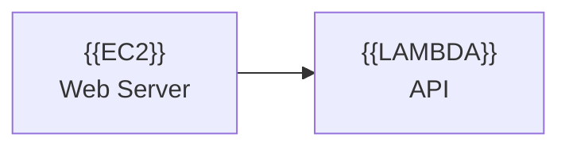

# Quick Reference Guide

## 🚀 Getting Started

1. **Place your `.mmd` files in the `mmd_files/` directory**
2. **Run the compiler:**
   ```bash
   python3 compiler.py your_file.mmd
   ```
3. **Find your output:** `mmd_files/your_file.png`

## 📝 Icon Syntax

Use `{{ICON_NAME}}` in your Mermaid diagrams:



## 🎨 Available Icons

| Shorthand | Service |
|-----------|---------|
| `{{EC2}}` | Amazon EC2 |
| `{{LAMBDA}}` | AWS Lambda |
| `{{AURORA}}` | Amazon Aurora |
| `{{DYNAMODB}}` | Amazon DynamoDB |
| `{{RDS}}` | Amazon RDS |
| `{{S3}}` | Amazon S3 |
| `{{FOUNDRY}}` | Data Lake (placeholder) |

## ⚙️ Common Commands

```bash
# Basic compilation
python3 compiler.py input.mmd

# High resolution (5x scale)
python3 compiler.py input.mmd --scale 5

# Watch mode (auto-recompile)
python3 compiler.py input.mmd --watch

# Custom output name
python3 compiler.py input.mmd -o my_diagram.png
```

## 📁 Directory Structure

```
mmd_files/
├── input.mmd           ← Your Mermaid templates
├── input.png           ← Generated diagrams
└── simple_example.mmd  ← Example file
```

## ✨ Features

- ✅ Base64-encoded SVG icons (works reliably)
- ✅ Automatic path resolution
- ✅ High-resolution output (configurable scale)
- ✅ Watch mode for live updates
- ✅ Validation and error checking
- ✅ Transparent backgrounds

## 🔧 Adding New Icons

Edit `ICON_MAP` in `compiler.py`:

```python
ICON_MAP: Dict[str, str] = {
    "YOUR_ICON": "icons/path/to/icon.svg",
    # ...
}
```

Then use `{{YOUR_ICON}}` in your `.mmd` files.
