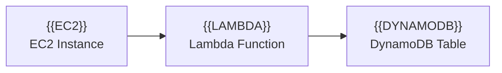
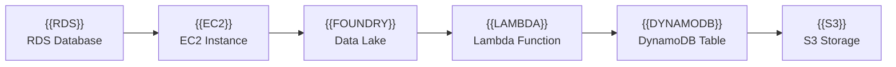

# Diagrams-as-Code Pipeline (parii_plots)

A Python-based pipeline for creating infrastructure diagrams using Mermaid.js with custom local icon support for AWS and Azure services.

## 🚀 Quick Start

```bash
# Install dependencies
pip install -r requirements.txt

# Create a diagram
python3 compiler.py input.mmd

# Output will be in mmd_exports/input.png
```

## ✨ Features

- 🎨 Custom shorthand syntax for cloud icons (e.g., `{{EC2}}`, `{{AZURE_ML}}`)
- 📦 Base64-encoded SVG icons (reliable rendering)
- 🖼️ High-resolution PNG output (configurable scale)
- 👀 Watch mode for automatic re-rendering on file changes
- 🌐 Multi-cloud support (AWS & Azure)
- ✅ Pre-flight validation of dependencies and icon paths
- 🔧 Comprehensive error handling and detailed logging

## Prerequisites

### 1. Install Mermaid CLI

```bash
npm install -g @mermaid-js/mermaid-cli
```

Verify installation:
```bash
mmdc --version
```

### 2. Install Python Dependencies

```bash
pip install -r requirements.txt
```

Or manually:
```bash
pip install watchdog
```

## Project Structure

```
parii_plots/
├── compiler.py          # Main compiler script
├── mmd_files/          # Input: Mermaid templates (.mmd)
│   ├── input.mmd       # Example AWS architecture
│   ├── simple_example.mmd
│   ├── azure_ai_example.mmd
│   └── hybrid_ai_pipeline.mmd
├── mmd_exports/        # Output: Generated PNG diagrams
├── requirements.txt    # Python dependencies
├── icons/             # Local SVG icon library
│   ├── AWS_Icons/
│   └── Azure_Icons/
├── README.md          # This file
├── QUICK_REFERENCE.md # Quick reference guide
└── ICON_REFERENCE.md  # Icon catalog
```

## Usage

### Basic Compilation

Compile a `.mmd` file to PNG (the script looks in `mmd_files/` directory by default):

```bash
python3 compiler.py input.mmd
```

This will:
- Read `mmd_files/input.mmd`
- Generate `mmd_files/input.png`

You can also specify a custom output name:

```bash
python3 compiler.py input.mmd -o my_diagram.png
```

This will still save to `mmd_files/my_diagram.png`.

### High-Resolution Output

Increase the scale factor for higher resolution:

```bash
python3 compiler.py input.mmd --scale 5
```

### Watch Mode

Automatically recompile when the input file changes:

```bash
python3 compiler.py input.mmd --watch
```

Press `Ctrl+C` to stop watching.

### Command-Line Options

```
python3 compiler.py [-h] [-o OUTPUT] [-s SCALE] [-w] input

Positional Arguments:
  input                 Input Mermaid file name (looks in mmd_files/ directory)

Optional Arguments:
  -h, --help            Show help message and exit
  -o OUTPUT, --output OUTPUT
                        Output PNG filename (saves to mmd_exports/)
  -s SCALE, --scale SCALE
                        Scale factor for resolution (default: 3)
  -w, --watch           Watch input file for changes and recompile
```

## Available Icons

### AWS Services
- `{{EC2}}` - Amazon EC2
- `{{LAMBDA}}` - AWS Lambda
- `{{AURORA}}` - Amazon Aurora
- `{{DYNAMODB}}` - Amazon DynamoDB
- `{{RDS}}` - Amazon RDS
- `{{S3}}` - Amazon S3

### Azure Services
- `{{AZURE_ML}}` - Azure Machine Learning
- `{{FOUNDRY}}` / `{{AZURE_AI_STUDIO}}` - Azure AI Studio / AI Foundry
- `{{AZURE_OPENAI}}` - Azure OpenAI
- `{{AZURE_COGNITIVE}}` - Azure Cognitive Services
- `{{AZURE_BOT}}` - Azure Bot Services

**See [ICON_REFERENCE.md](ICON_REFERENCE.md) for hundreds more icons and how to add them!**

### Adding New Icons

Edit the `ICON_MAP` dictionary in `compiler.py`:

```python
ICON_MAP: Dict[str, str] = {
    "EC2": "icons/AWS_Icons/.../Arch_Amazon-EC2_64.svg",
    "YOUR_ICON": "icons/path/to/your/icon.svg",
    # Add more mappings...
}
```

### Using Icons in Mermaid

In your `.mmd` file (stored in `mmd_files/`), use the shorthand syntax with HTML line breaks:



The compiler will replace `{{EC2}}` with an embedded base64-encoded SVG image tag.

## Example

The included `mmd_files/input.mmd` demonstrates a sample architecture:



Compile it:
```bash
python3 compiler.py input.mmd
```

Output: `mmd_exports/input.png` with embedded AWS icons at 3x resolution.

## 📚 Additional Documentation

- **[QUICK_REFERENCE.md](QUICK_REFERENCE.md)** - Quick reference for common commands and icon syntax
- **[ICON_REFERENCE.md](ICON_REFERENCE.md)** - Complete icon catalog and guide to adding new icons
- **[quickstart.sh](quickstart.sh)** - Automated setup checker and examples

## How It Works

1. **Pre-flight Checks**: Validates that `mmdc` is installed and icon paths exist
2. **Template Reading**: Reads the input `.mmd` file from `mmd_files/` directory
3. **Icon Substitution**: Replaces `{{ICON_NAME}}` tags with base64-encoded SVG data URI `` tags
4. **Temporary File**: Writes the processed Mermaid code to a temporary file
5. **Rendering**: Executes `mmdc` with the temporary file to generate PNG in `mmd_files/`
6. **Cleanup**: Removes the temporary file

## Troubleshooting

### mmdc not found

```
✗ Error: mmdc not found. Install it with: npm install -g @mermaid-js/mermaid-cli
```

**Solution**: Install Mermaid CLI globally using npm.

### Icon path not found

```
✗ Warning: Icon 'EC2' path not found: /path/to/icon.svg
```

**Solution**: Verify the icon exists at the specified path or update `ICON_MAP` in `compiler.py`.

### Images not showing in output

- The script now uses base64-encoded data URIs to embed SVGs directly
- Check that SVG files are valid and not corrupted
- Try increasing the `--scale` factor
- Verify icons exist by checking the validation output when running the script

### Watch mode not working

```
✗ Error: watchdog not installed. Install it with: pip install watchdog
```

**Solution**: Install the watchdog package: `pip install watchdog`

## Notes

- All `.mmd` input files should be placed in the `mmd_files/` directory
- All `.png` output files will be saved to the `mmd_exports/` directory
- The compiler uses base64-encoded data URIs for icons, ensuring they work reliably in mmdc's headless browser
- Icon dimensions are set to 48x48 pixels in the generated `` tags (adjustable in code)
- Background is set to transparent by default
- The script includes debouncing in watch mode to prevent multiple rapid recompilations

## 🤝 Contributing

Contributions welcome! Feel free to:
- Add new icon mappings
- Improve error handling
- Add new features
- Report bugs

## 📝 License

MIT License - Feel free to modify and use for your projects.
